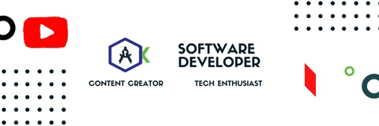

<h1>Hey There! My name is Mayur Kukreja</h1>
<code><strong>Software Developer 😉</strong>
  <code>Student</code>
  <code>Indian ❤️</code>
  <code>Currently working on Flutter</code>
</code>
<br/><br/>
<code>Exploring Open Source ❤️</code>
  


## 🚀 GitHub Stats

  <br>
  <br><br>
  
  ```javascript
const mayur = {
    pronouns: "He" | "Him",
    code: ["Java", "Python", "JavaScript", "Dart", "PHP", "C++"],
    webDev: ["HTML", "CSS", "JavaScript"]
    askMeAbout: ["web dev", "tech", "app dev", "photography"],
        mobileApp: {
            native: ["Android Development", "IOS Development"]
        },
        researchPaperInProgress: ["Network Security using Machine Learning"]
        databases: ["mongo", "MySql", "sqlite", "Firestore"],
        misc: ["Firebase", "Socket.IO", "open-cv", "php"]
    },
    architecture: ["Serverless Architecture", "Progressive web applications", "Single page applications"],
    currentFocus: "Flutter App Development",
    quoteByMe: "The Universe is a transformation, our life is what our thoughts make it."
};
```
<code>Hope you are having a Great Day!❤️</code>


  ## ▶ Click Me 👇
  [](https://www.youtube.com/watch?v=BCT4n6a22ZI)

  ## **If you love any of my projects or content and wish to Support me**,

  <a href="https://www.buymeacoffee.com/mayurkukreja" target="_blank"></a>

</div>
<!---
mayurrkukreja/mayurrkukreja is a ✨ special ✨ repository because its `README.md` (this file) appears on your GitHub profile.
You can click the Preview link to take a look at your changes.
--->
